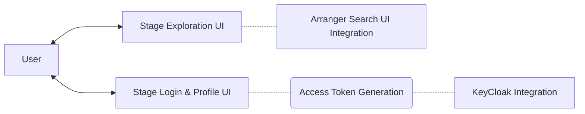

# Overview

Stage is a simple React-based user interface designed to prop up browser-accessible data portals. Although Stage can be used for any web application, it's designed to integrate with Keycloak and Arranger (see the section on [system architecture](#system-architecture) for more details).

## Key Features

- **Identity and access management UI:** pre-built login and profile pages integrated with Keycloak and configurable with SSO-identity provider logins including, Google, GitHub, LinkedIn and ORCiD.
- **Data exploration UI:** built to integrate with Arranger for API-linked data exploration components.
- **URL parametrisation support:** dynamic URLs that can be modified or updated based on input parameters, enhancing flexibility and shareability of application states.
- **Extensible layout:** a flexible structure and foundation for creating a custom UI for your project with a customizable footer and navbar including primary and secondary menus.
- **Theme customisation with emotion:** dynamic styling capabilities with fine-grained control over individual component appearances.


## System Architecture

Stage's primary function is to serve as a launchpad for creating custom data portal user interfaces. It achieves this by providing fundamental portal UI components for navigation and authentication, and data exploration.



## Repository Structure

```
.
├── /components/
│   ├── /pages/
│   ├── /theme/
│   └── /utils/
├── /global
├── /pages/
│   ├── /api/
│   ├── /explorer/
│   ├── /login/
│   └── /user/
├── /public
└── /tests
```

:::note[Stage Repo]

To view the respository on GitHub [click here](https://github.com/overture-stack/stage)

:::

#### Components

#### Global

#### Pages

#### Public

#### Tests
