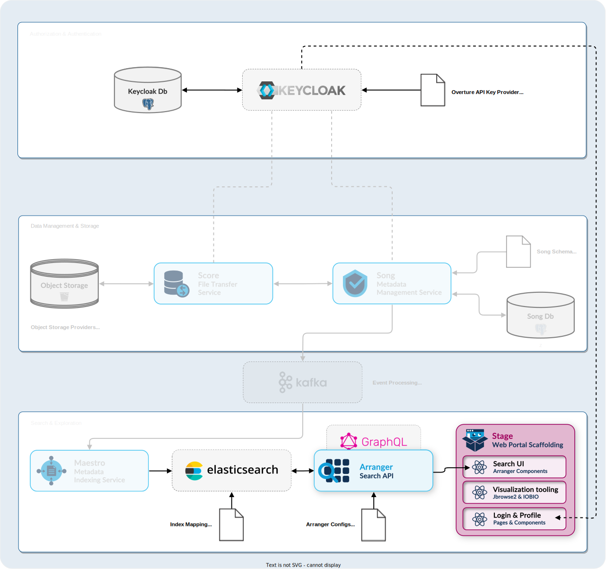

# Setup

## Prerequisites

Before you begin, ensure you have the following installed on your system:

- [Node.js](https://nodejs.org/) (v16 or higher)
- [npm](https://www.npmjs.com/) (v8.3.0 or higher)
- [Docker](https://www.docker.com/) (v4.39.0 or higher)

## Developer Setup

This guide will walk you through setting up a complete development environment, including Stage and its complementary services.

### Setting up supporting services

We'll use our Quickstart service, a flexible Docker Compose setup, to spin up Stage's complementary services.

1. Clone the Quickstart repository and move into its directory:

   ```bash
   git clone -b quickstart https://github.com/overture-stack/prelude.git
   cd prelude
   ```

2. Run the appropriate start command for your operating system:

   | Operating System | Command               |
   | ---------------- | --------------------- |
   | Unix/macOS       | `make stageDev`       |
   | Windows          | `./make.bat stageDev` |

    <details>
    <summary>**Click here for a detailed breakdown**</summary>

   This command will set up all complementary services for Stage development as follows:

   

   | Service         | Port   | Description                                     | Purpose in Stage Development                          |
   | --------------- | ------ | ----------------------------------------------- | ----------------------------------------------------- |
   | Conductor       | -      | Orchestrates deployments and environment setups | Manages the overall development environment           |
   | Keycloak        | `8080` | Authorization and authentication service        | Provides OAuth2 authentication for Stage              |
   | Arranger Server | `5050` | GraphQL API for data querying                   | Handles data queries for Stage's search functionality |
   | Elasticsearch   | `9200` | Search and analytics engine                     | Stores and indexes data for Arranger                  |

   - Ensure all ports are free on your system before starting the environment.
   - You may need to adjust the ports in the `docker-compose.yml` file if you have conflicts with existing services.

   For more information on configuring and using these services, see our [Quickstart documentation linked here](https://docs.overture.bio/docs/other-software/Quickstart)

    </details>

In the next steps, we will run a Stage development server against these supporting services.

### Running the Development Server

1.  Clone Stage and move into its directory:

    ```bash
    git clone https://github.com/overture-stack/stage.git
    cd stage
    ```

2.  Configure environment variables:

    ```bash
    mv .env.stage .env
    ```

    :::info

    This `.env` file is preconfigured as follows for the Stage dev environment:

         ```
          # Stage Variables
          NEXTAUTH_URL=http://localhost:3000/api/auth
          NEXT_PUBLIC_LAB_NAME=Stage Development Environment
          NEXT_PUBLIC_ADMIN_EMAIL=contact@overture.bio
          NEXT_PUBLIC_DEBUG=true
          NEXT_PUBLIC_SHOW_MOBILE_WARNING=true

          # Keycloak Variables
          NEXT_PUBLIC_AUTH_PROVIDER=keycloak
          ACCESSTOKEN_ENCRYPTION_SECRET=super_secret
          SESSION_ENCRYPTION_SECRET=this_is_a_super_secret_secret
          NEXT_PUBLIC_KEYCLOAK_HOST=http://keycloak:8080
          NEXT_PUBLIC_KEYCLOAK_REALM=myrealm
          NEXT_PUBLIC_KEYCLOAK_CLIENT_ID=webclient
          KEYCLOAK_CLIENT_SECRET=ikksyrYaKX07acf4hpGrpKWcUGaFkEdM
          NEXT_PUBLIC_KEYCLOAK_PERMISSION_AUDIENCE=dms

          # Arranger Variables
          NEXT_PUBLIC_ARRANGER_DOCUMENT_TYPE=file
          NEXT_PUBLIC_ARRANGER_INDEX=file_centric
          NEXT_PUBLIC_ARRANGER_API_URL=http://arranger-server:5050
          NEXT_PUBLIC_ARRANGER_MANIFEST_COLUMNS=repositories.code, object_id, analysis.analysis_id, study_id, file_type, file.name, file.size, file.md5sum, file.index_file.object_id, donors.donor_id, donors.specimens.samples.sample_id
         ```

         <details>
           <summary>**Click here for a detailed explanation of the Stage environment variables**</summary>
            - **Stage Variables**

               - `NEXTAUTH_URL`: Specifies the base URL for NextAuth.js, which handles authentication in Next.js applications. This setting is used to configure the authentication flow, including where to redirect users after successful authentication.
               - `NEXT_PUBLIC_LAB_NAME`: The name displayed in the top left of the portal interface. Feel free to customize this.
               - `NEXT_PUBLIC_ADMIN_EMAIL`: The email address of the administrator or support contact. This setting updates the help link found by default in the footer navigation of the portal interface.

            - **Keycloak Variables**

               - `NEXT_PUBLIC_AUTH_PROVIDER`: Specifies the authentication provider, in this case, "keycloak".
               - `ACCESSTOKEN_ENCRYPTION_SECRET`: Defines the secret used to encrypt access tokens, enhancing security by preventing easy decoding of intercepted tokens.
               - `SESSION_ENCRYPTION_SECRET`: Specifies the secret used to encrypt session cookies, protecting sensitive information stored in the cookie from unauthorized access.
               - `NEXT_PUBLIC_KEYCLOAK_HOST`: Specifies the URL where the Keycloak server is hosted (e.g., "http://localhost:8080").
               - `NEXT_PUBLIC_KEYCLOAK_REALM`: Defines the realm in Keycloak that contains the users and roles for the application.
               - `NEXT_PUBLIC_KEYCLOAK_CLIENT_ID`: The client ID for the Keycloak application.
               - `KEYCLOAK_CLIENT_SECRET`: The client secret for the Keycloak application.
               - `NEXT_PUBLIC_KEYCLOAK_PERMISSION_AUDIENCE`: Specifies the audience for the permission claims in the access token, restricting the scope of access granted to the token.

            - **Arranger Variables**
               - `NEXT_PUBLIC_ARRANGER_DOCUMENT_TYPE`: Specifies whether the index is file-centric or analysis (participant) centric.
               - `NEXT_PUBLIC_ARRANGER_INDEX`: Defines the index used by the Arranger service.
               - `NEXT_PUBLIC_ARRANGER_API_URL`: The URL of the Arranger GraphQL API. By default, Arranger's API is mapped to port 5050.
               - `NEXT_PUBLIC_ARRANGER_MANIFEST_COLUMNS`: Lists the columns to be included in the manifest generated for download with Score.
         </details>

    :::

3.  Install the required npm packages:

    ```bash
    npm ci
    ```

    :::tip
    Ensure you are running Node.js v16 or higher. To check, you can run `node --version`. You should see something similar to the following:

    ```bash
    v16.14.0
    ```

    :::

4.  Start the Stage development server:

    ```bash
    npm run dev
    ```

### Verification

After installation and configuration, verify that Stage is functioning correctly:

1. **Check the Stage UI**

   - Navigate to `http://localhost:3000` in a web browser.
   - Expected result: You should see the Stage front-end UI.
   - Troubleshooting:
     - Check your browser's console for error messages.
     - Verify that you're using the correct URL.

2. **Test Login Functionality**

   - Use the default Keycloak credentials:

     | Field    | Value      |
     | -------- | ---------- |
     | Username | `admin`    |
     | Password | `admin123` |

   - Expected result: You should be able to log in and access the Stage dashboard.
   - Troubleshooting:
     - Ensure Keycloak is running and configured correctly.
     - Check the Stage server logs for authentication-related errors.

3. **Test API Key Functionality**
   - From the top right dropdown, select "Profile".
   - On the profile page, select "Generate API Key".
   - Expected result: A new API key should be generated and displayed on the screen.

:::info Need Help?
If you encounter any issues or have questions about our API, please don't hesitate to reach out through our relevant [**community support channels**](https://docs.overture.bio/community/support).
:::

:::warning
This guide is meant to demonstrate the configuration and usage of Stage for development purposes and is not intended for production. If you ignore this warning and use this in any public or production environment, please remember to use appropriate security measures and configure your environment variables accordingly.
:::
